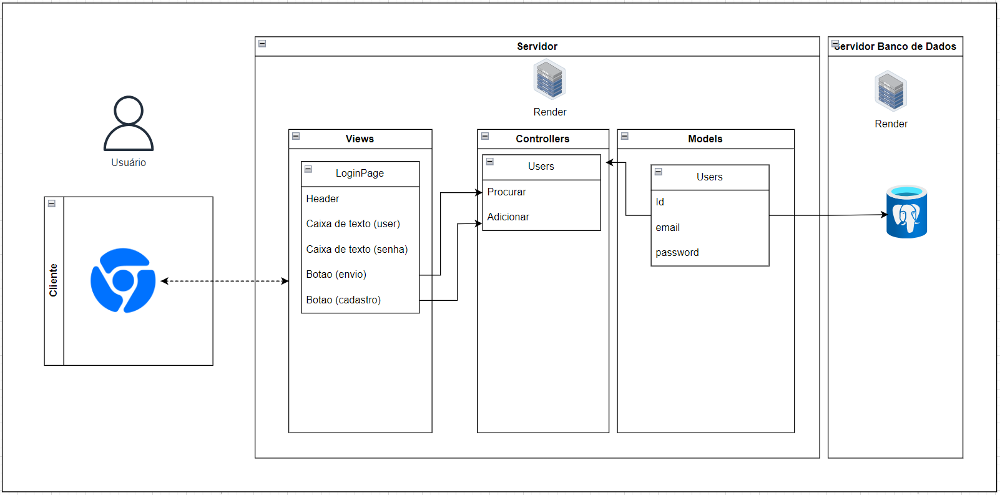

# PonderadaMVC

  

# Arquitetura MVC 
- Nome do Projeto: Tela de login - Web Culture Group
- Descrição: [Insira uma breve descrição do seu projeto]
- Arquitetura: MVC (Model-View-Controller)
- Ferramenta de Diagramação: draw.io

### Modelos (Models):
- Descreva as entidades do seu projeto e seus atributos.
- Explique as relações entre as entidades.

### Controladores (Controllers):
- Liste os controladores do seu projeto e suas responsabilidades.
- Descreva as ações (methods) de cada controlador e seus parâmetros de entrada e saída.
- Explique como os controladores interagem com os modelos e views.

### Views (Views):
- Liste as views do seu projeto e sua função.

### Infraestrutura:

- Descreva os componentes de infraestrutura do seu projeto, como bancos de dados, APIs externas e outras dependências.
- Explique como a infraestrutura se integra à arquitetura MVC.

### Justifique as escolhas feitas e como elas impactam o projeto.
#### Implicações da Arquitetura:
Descreva as implicações da arquitetura em termos de escalabilidade, manutenção, testabilidade e outros aspectos importantes.