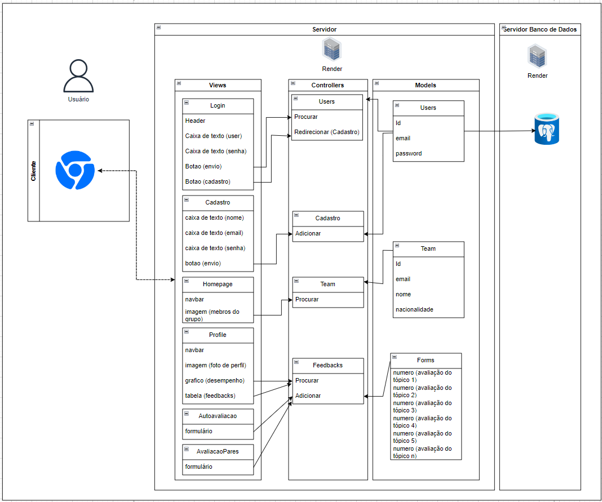

# PonderadaMVC

  

# Arquitetura MVC 
- Nome do Projeto: Interculturalist 
- Descrição: Site desenvolvido pela WebCulture Group, o qual terá como objetivo principal melhorar a convivência dentro dos grupos participantes do Cesim Game, assim como proprocionar a esses participantes uma visão geral do seu desempenho no game, seja do seu ponto de vista ou do ponto de vista de seus pares.
- Arquitetura: MVC (Model-View-Controller)
- Ferramenta de Diagramação: draw.io

### Modelos (Models):
- Users
  - Id: código de identificação de cada usuário, utilizado para facilitar pesquisas no banco de dados. Esse model não será de conhecimento do usuário, servindo apenas para organização.

  - email: armazena o email de cada usuário, sendo necessário para fazer login na página. No ato de cadastro, essa informação é inserida no banco de dados, e depois passa a ser apenas verificada para efetivação do login.

  - password: armazena a senha de cada usuário, sendo necessária para confirmar o login na página. No ato de cadastro, essa informação é inserida no banco de dados, e depois passa a ser apenas verificada para efetivação.

- Team:
  - Id: código de identificação de cada usuárioo membro do grupo, utilizado para facilitar pesquisas no banco de dados. Esse model não será de conhecimento do usuário, servindo apenas para organização.

  - email: armazena o email do membro do grupo que está sendo visualizado, sendo disponibilizado na tela de perfil pro caso da necessidade de contato direo entre esses membros.

  - nacionalidade: armazena o país de origem do mebro do grupo que está sendo visualizado, sendo disponibilizado em seu perfil a fim de que seus colegas tenham conehcimento de sua nacionalidade e, caso queriram, possam pesquisar mais sobre sua cultura.

- Forms:
  - numero: valor dado como resultado da avaliação do critério em específico. Por exemplo, se um mebro do time avalia a si mesmo ou algum membro no grupo com nota 5 no quesito liderança, essa nota é armazenada em "numero"

### Controladores (Controllers):
- Users
  - Procurar: verifica se o login e senha existem no banco de dados. Assim, seus parâmetros são os conteúdos digitados nos campos de login e senha. Esse controler é acionado quando o usuário clica no botão de envio na tela de login.

  - Adicionar: acionado no ato de cadastro, que ocorre na primeira vez que o usuário acessa o site, esse controler leva o usuário para a tela de cadastro.
  
- Cadastro
  - Adicionar: esse controler insere novos dados de login e senha no banco de dados, sendo  acionado quando o usuário clica no botão de envio na tela de cadastro.

- Team
  - Procurar: quando o usuário seleciona um dos membros do grupo para visualizar, esse controller busca esse mebro no banco de dados para poder exibir o perfil na tela do usuário.

- Feedbacks
  - Procurar: acionado quando o usuário clica para ver suas avaliações ou para avaliar seus pares, esse controller busca no banco de dados as avaliações recebidas pelo usuário ou então as avaliações que ele precisa responder.

  - Adicionar: acionado quando o usuário avalia algum de seus pares ou a si mesmo, esse controller é responsável por adicionar essa avaliação no banco de dados.

### Views (Views):
- **Login:** Tela utilizada para verificação de acesso dos usuários ao site. Assim, essa tela é relativamente simples, e é acessada todas as vezes que o usuário desejar utilizar o site, a fim de garantir que apenas pessoas autorizadas tenham acesso ao conteúdo do site, assim como garantir que cada usuário acesse apenas as informações do seu time.

- **Cadastro:** Tela utilizada para cadastrar os usuário em seu primeiro acesso ao site. Assim, essa tela é acessada uma única vez pelo usuário, a fim de criar seu acesso ao site.

- **Homepage:** Primeira tela a ser vista pelo usuário quando ele entra no site, a homepage apresenta as fotos de todos os membros do grupo, e o usuário pode acessar o perfil desses membros para visualizar infromações informações mais específicas além da foto de perfil.

- **Profile:** O usuário, ao acessar o perfil de algum membro do seu grupo, ou até o seu próprio perfil, encontra essa tela, na qual estão disponíveis informações como nome, nacionalidade, email e desempenho no grupo. O objetivo dessa tela varia de acordo com o acesso: se o usuário acessa o seu próprio perfil, o objetivo da tela é que ela possa ter uma análise de seu desempenho, assim como uma comparação entre sua autoavaliação e a avaliação de seus pares; entretanto, quando o usuário acessa a tela de perfil de algum de seus colegas, o objetivo da tela é permitir com que ele conheça melhor o dono do perfil em questão, ou então possua informações sobre um contatos mais direto (nesse caso, o endereço de email).

- **Autoavaliacao:** Tela acessada pelo usuário quando ele precisar responder sua autoavaliação. Aqui, seão disponibilizados formulários com algumas competências, nas quais o usuário precisará atribuir-se uma nota. Em suma, essa tela é apenas um formulário para o usuário avaliar o seu próprio desempenho no grupo.

- **AvaiacaoPares:** Tela acessada pelo usuário quando ele precisar responder a valiação de seus pares. Aqui, seão disponibilizados formulários com algumas competências, nas quais o usuário precisará atribuir uma nota para seus colegas. Em suma, essa tela é apenas um formulário para o usuário avaliar o desempenho de cada um dos seus colegas de time.

### Infraestrutura:
#### Componentes de infraestrutura:

1. **Banco de dados:** Utilização de um banco de dados relacional (PostgreSQL) para armazenar informações dos usuários, equioes e feedbacks. Isso proporciona uma estrutura organizada para armazenamento e recuperação de dados.

2. **APIs Externas:**

3. **Servidor Web:** implantação de um servidor web (DBeaver) para hospedar a aplicação web, forncendo acesso aos clientes por meio da internet.

4. **Ferramentas de desenvolvimento:** uso de ferramentas como draw.io para diagramação da arquitetura, assim como sails.js para estruturação da regra de negócio e VS Code para criação da regra de negócio.

#### Integração com a arquitetura MVC:
##### Banco de dados (model):
- Os modelos (Models) definidos (Users, Team, Forms) representam as entidades do banco de dados. Eles encapsulam a lógica de negócios e interagem diretamente com o banco de dados para recuperar e manipular os dados. Por exemplo, o modelo Users seria responsável por lidar com operações relacionadas aos usuários, como adicionar novos usuários e verificar credenciais de login.

##### APIs Externas (Model/Controller):
- controllers
  - account
    - logout.js
    - update-billing-card.js
    - update-password.js
    - update-profile.js
    - view-account-overview.js
    - view-edit-password.js
    - view-edit-profile.js
  - dashboard
    - view-welcome.js
  - entrance
    - confirm-email.js
    - login.js
    - send-password-recovery-email.js
    - signup.js
    - update-password-and-login.js
    - view-confirmed-email.js
    - view-forgot-password.js
    - view-login.js
    - view-new-password.js
    - view-signup.js
  - legal
    - view-privacy.js
    - view-terms.js
  - deliver-contact-form-message.js
  - observe-my-session.js
  - view-contact.js
  - view-faq.js
  - view-homepage-or-redirect.js

- helpers
  - broadcast-session-change.js
  - redact-user.js
  - send-template-email.js

- hooks/custom
  - index.js

- models
  - User.js

- policies
  - is-logged-in.js
  - is-super-admin.js

- responses
  - expired.js
  - unauthorized.js
    
##### Servidor Web (controller/Views):
- Os controladores são responsáveis por processar as solicitações dos usuários e chamar os modelos apropriados para manipular os dados necessários. Em seguida, os controladores selecionam as visualizações corretas para renderizar a resposta. Por exemplo, quando um usuário faz login, o controlador Users processa a solicitação, verifica as credenciais no modelo Users e, em seguida, redireciona o usuário para a visualização adequada, como a Homepage.

### Justifique as escolhas feitas e como elas impactam o projeto.
#### Implicações da Arquitetura:
- **Escalabilidade:**
  - A separação clara de responsabilidades entre modelos, visualizações e controladores facilita a escalabilidade do projeto. Novas funcionalidades podem ser adicionadas sem alterar drasticamente o código existente, e diferentes partes da aplicação podem ser escaladas independentemente, conforme necessário.

- **Manutenção:**
  - A arquitetura MVC facilita a manutenção do código, pois separa as diferentes partes da aplicação em componentes distintos. Isso torna mais fácil localizar e corrigir problemas, além de facilitar a implementação de novos recursos ou a atualização de funcionalidades existentes.

- **Testabilidade:**
  - A separação clara de camadas na arquitetura MVC facilita a escrita e execução de testes automatizados. Os modelos podem ser testados independentemente da lógica de visualização ou controle, o que facilita a validação do comportamento do sistema em diferentes cenários.

- **Organização e reutilização de código:**
  - A divisão do projeto em modelos, visualizações e controladores promove a organização do código e facilita a reutilização de componentes. Isso torna o desenvolvimento mais eficiente e ajuda a manter um código limpo e legível ao longo do tempo.

- **Flexibilidade:**
  - A arquitetura MVC permite uma maior flexibilidade no desenvolvimento de aplicativos web, pois separa a lógica de negócios da apresentação e do controle de fluxo. Isso facilita a adaptação do sistema a novos requisitos ou mudanças no ambiente de desenvolvimento.